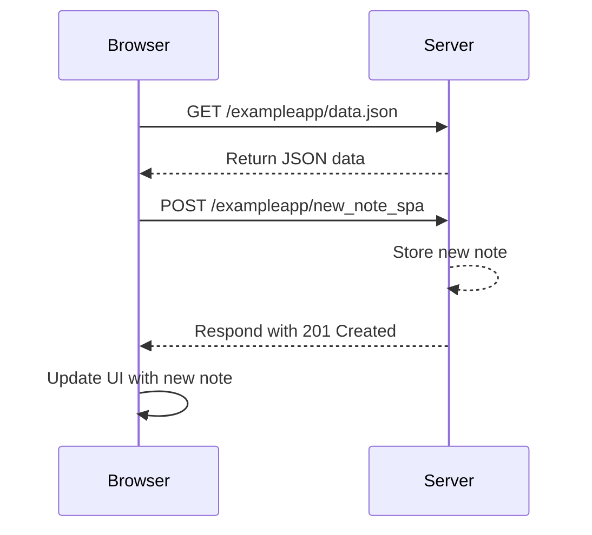

```mermaid
    sequenceDiagram
    participant Browser
    participant Server

    Browser->>Server: GET /exampleapp/data.json

    Server-->>Browser: Return JSON data

    Browser->>Server: POST /exampleapp/new_note_spa

    Server-->>Server: Store new note

    Server-->>Browser: Respond with 201 Created

    Browser->>Browser: Update UI with new note
```
